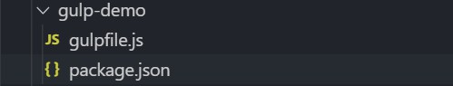
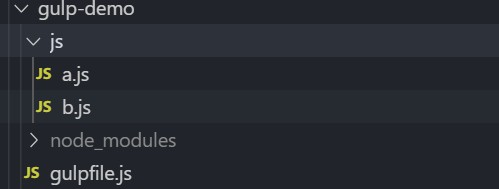
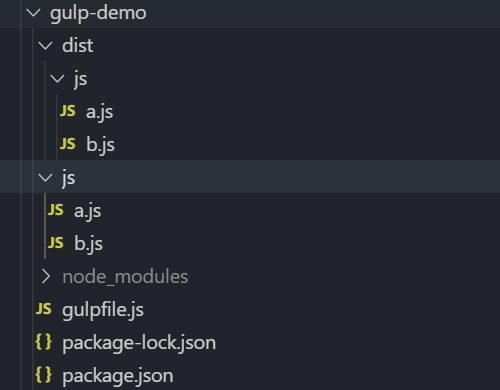

# Gulp使用教程

gulp 是基于 node 实现 Web 前端自动化开发的工具，利用它能够极大的提高开发效率。

在 Web 前端开发工作中有很多“重复工作”，比如压缩CSS/JS文件。而这些工作都是有规律的。找到这些规律，并编写 gulp 配置代码,让 gulp 自动执行这些“重复工作”。

[TOC]

## 一. 安装Node和gulp

1. **安装node：**由于gulp是基于node实现的，所以要先安装node

   - [node安装（菜鸟教程）](http://www.runoob.com/nodejs/nodejs-install-setup.html)
   - [廖雪峰-node和npm的安装](https://www.liaoxuefeng.com/wiki/1022910821149312/1023025597810528)
   - 二者选其一即可

2. **安装gulp**

   - 安装

   ~~~shell
   npm install -g gulp
   ~~~

   - 查看版本

   ~~~shell
   gulp -v
   ~~~

   

## 二.使用gulp压缩Js

压缩js文件可以降低js文件的大小，提高页面打开速度。

### 2.1 方法

- 找到要压缩的所有的js文件，压缩它们，将压缩后的文件放在 `dist/js/目录下`

### 2.2 步骤

**1. 创建gulp-demo文件夹，使用`npm`初始化项目**

~~~shell
npm init
~~~

**2. 在项目根目录新建一个`gulpfile.js`文件**

- gulp所有的配置都在这个文件里面

**3. 在gulpfile文件中书写压缩js文件的代码，安装gulp 和 gulp-uglify压缩模块**

~~~js
//获取gulp对象
const gulp = require("gulp")

// 压缩js文件爱你的对象，使用之前需要安装
// 安装方法：npm i gulp-uglify -D
const uglify = require("gulp-uglify")

// 定义压缩文件的处理方法
function script(){
    //1. 匹配要所有压缩的js文件
    gulp.src('js/*.js')
    //2. 压缩文件
    .pipe(uglify())
    //3. 将压缩后的文件写入指定目录
    .pipe(gulp.dest('dist/js'))
}

//将定义好的压缩方法暴露给外界
exports.script = gulp.series(script);
~~~

~~~shell
npm i gulp gulp-uglify -D
~~~

**4.  在项目根目录创建js文件夹并且创建需要测试的js文件**

**5. 在命令行输入如下命令运行**

- 由于我们导入的为 script，所以这里输入`gulp script`命令即可

~~~shell
gulp script
~~~

- 压缩后的目录如下所示

**6. 升级压缩功能，每次文件修改之后，自动压缩打包**

~~~js
//获取gulp对象
const gulp = require("gulp")

// 压缩js文件爱你的对象，使用之前需要安装
// 安装方法：npm i gulp-uglify -D
const uglify = require("gulp-uglify")

// 定义压缩文件的处理方法
function script(){
    //1. 匹配要所有压缩的js文件
    gulp.src('js/*.js')
    //2. 压缩文件
    .pipe(uglify())
    //3. 将压缩后的文件写入指定目录
    .pipe(gulp.dest('dist/js'))
}

//创建监听js文件的方法
function autoScript(){
    // 创建监听对象
    var watcher = gulp.watch("js/*.js");

    //分别监听 change,add,unlink事件
    watcher.on("change",function(path,stats){
        console.log(`${path} has been changed!`);
    });
    watcher.on("add",function(path,stats){
        console.log(`${path} has been add!`);
    });
    watcher.on("unlink",function(path,stats){
        console.log(`${path} has been unlink!`);
    })
}

//将定义好的压缩方法暴露给外界，并作为gulp的默认值
// exports.script = gulp.series(script,autoScript);
exports.autoScript = gulp.parallel(script,autoScript);
~~~

- 运行

~~~shell
gulp autoScript
~~~

**7. 使用 exports.default 定义默认任务**

~~~js
//如上所示，我们使用 export script 和 export autoScript命令执行任务
//可以通过 exports.default 关键字指定默认任务
exports.default = gulp.parallel(script,autoScript);
~~~

- 设置完成之后，在命令行输入 gulp即可启动任务

~~~shell
gulp
~~~

- **完整项目目录：gulp-demo(压缩js)**

- 注意：所有的项目，下载之后先在项目根目录要运行 `npm i`命令安装模块

## 三. 压缩CSS文件

CSS文件压缩过程类似于Js文件，这里做简单介绍

### 3.1 步骤

**1.创建gulpfile.js文件**

**2. 安装压缩CSS文件需要用到的模块**

~~~shell
npm i gulp gulp-minify-css -D
~~~

**3. 在项目根目录创建CSS文件夹，在CSS文件夹下面创建要测试的CSS文件**

**4. 编写压缩代码，到处任务调用**

~~~shell
//获取gulp对象
const gulp = require("gulp")

//获取压缩 css文件的方法
const minifyCss = require("gulp-minify-css")

// 定义压缩文件的处理方法
function css(){
    //1. 匹配要所有压缩的css文件
    gulp.src('css/*.css')
    //2. 压缩文件
    .pipe(minifyCss())
    //3. 将压缩后的文件写入指定目录
    .pipe(gulp.dest('dist/css'))
}

//升级：自动监听文件的改变，
//创建监听js文件的方法
function autoCss(){
    // 创建监听对象
    var watcher = gulp.watch("css/*.css");

    //分别监听 change,add,unlink事件
    watcher.on("change",function(path,stats){
        console.log(`${path} has been changed!`);
    });
    watcher.on("add",function(path,stats){
        console.log(`${path} has been add!`);
    });
    watcher.on("unlink",function(path,stats){
        console.log(`${path} has been unlink!`);
    })
}

//将定义好的压缩方法暴露给外界，并作为gulp的默认值
// exports.default = gulp.series(css,autoCss);
exports.autoCss = gulp.parallel(css,autoCss);
~~~

**5. 运行文件**

~~~shell
gulp autoCss
~~~

- **完整项目目录：gulp-demo(压缩CSS)**
- 注意：所有的项目，下载之后先在项目根目录要运行 `npm i`命令安装模块

## 四. 压缩图片

方法同上压缩js 和CSS文件，以下给出压缩图片的依赖模块，以及示例代码

**依赖模块：**gulp ，gulp-imagemin

**代码示例：**

~~~js
//获取gulp对象
const gulp = require("gulp")

//获取压缩 图片文件的对象
const imagemin = require("gulp-imagemin")

// 定义压缩文件的处理方法
function images(){
    //1. 匹配要所有压缩的图片文件
    gulp.src('imgs/*.*')
    //2. 压缩文件
    .pipe(imagemin({
        progressive: true
    }))
    //3. 将压缩后的文件写入指定目录
    .pipe(gulp.dest('dist/imgs'))
}

//升级：自动监听文件的改变，
//创建监听js文件的方法
function autoImages(){
    // 创建监听对象
    var watcher = gulp.watch("imgs/*.*");

    //分别监听 change,add,unlink事件
    watcher.on("change",function(path,stats){
        console.log(`${path} has been changed!`);
    });
    watcher.on("add",function(path,stats){
        console.log(`${path} has been add!`);
    });
    watcher.on("unlink",function(path,stats){
        console.log(`${path} has been unlink!`);
    })
}

//将定义好的压缩方法暴露给外界，并作为gulp的默认值
// exports.images = gulp.series(images,autoImages);
exports.autoImages = gulp.parallel(images,autoImages);
~~~

- **完整项目目录：gulp-demo(压缩图片)**
- 注意：所有的项目，下载之后先在项目根目录要运行 `npm i`命令安装模块

## 五. 编译Less文件

**模块：**gulp，gulp-less

**示例：**

~~~js
//获取gulp对象
const gulp = require("gulp")

//获取压缩 less文件的对象
const gulpLess = require("gulp-less")

// 定义压缩文件的处理方法
function less(){
    //1. 匹配要所有压缩的less文件
    gulp.src('less/*.less')
    //2. 压缩文件
    .pipe(gulpLess())
    //3. 将压缩后的文件写入指定目录
    .pipe(gulp.dest('dist/less'))
}

//升级：自动监听文件的改变，
//创建监听js文件的方法
function autoLess(){
    // 创建监听对象
    var watcher = gulp.watch("less/*.less");

    //分别监听 change,add,unlink事件
    watcher.on("change",function(path,stats){
        console.log(`${path} has been changed!`);
    });
    watcher.on("add",function(path,stats){
        console.log(`${path} has been add!`);
    });
    watcher.on("unlink",function(path,stats){
        console.log(`${path} has been unlink!`);
    })
}

//将定义好的压缩方法暴露给外界，并作为gulp的默认值
// exports.images = gulp.series(less,autoLess);
exports.autoLess = gulp.parallel(less,autoLess);
~~~

- **完整项目目录：gulp-demo(编译less)**
- 注意：所有的项目，下载之后先在项目根目录要运行 `npm i`命令安装模块

## 六. 编译Sass文件

**模块：**gulp，gulp-sass

**示例：**

~~~js
//获取gulp对象
const gulp = require("gulp")

//获取压缩 sass文件的对象
const gulpSass = require("gulp-sass")

// 定义压缩文件的处理方法
function sass(){
    //1. 匹配要所有压缩的sass文件
    gulp.src('sass/*.scss')
    //2. 压缩文件
    .pipe(gulpSass())
    //3. 将压缩后的文件写入指定目录
    .pipe(gulp.dest('dist/sass'))
}

//升级：自动监听文件的改变，
//创建监听js文件的方法
function autoSass(){
    // 创建监听对象
    var watcher = gulp.watch("sass/*.scss");

    //分别监听 change,add,unlink事件
    watcher.on("change",function(path,stats){
        console.log(`${path} has been changed!`);
    });
    watcher.on("add",function(path,stats){
        console.log(`${path} has been add!`);
    });
    watcher.on("unlink",function(path,stats){
        console.log(`${path} has been unlink!`);
    });
    watcher.on("error",function(error){
        console.log(error);
    })
}

//将定义好的压缩方法暴露给外界，并作为gulp的默认值
// exports.images = gulp.series(images,autoImages);
exports.autoSass = gulp.parallel(sass,autoSass);
~~~

- **完整项目目录：gulp-demo(编译sass)**
- 注意：所有的项目，下载之后先在项目根目录要运行 `npm i`命令安装模块