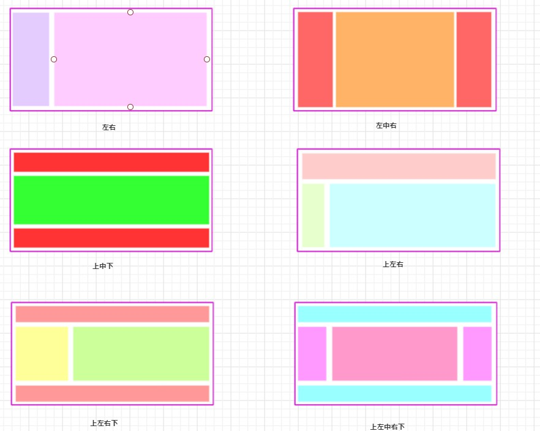
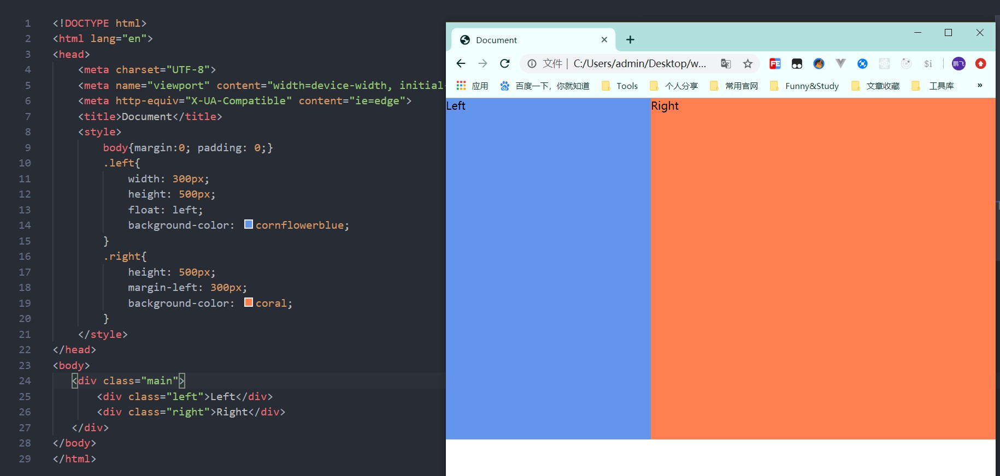
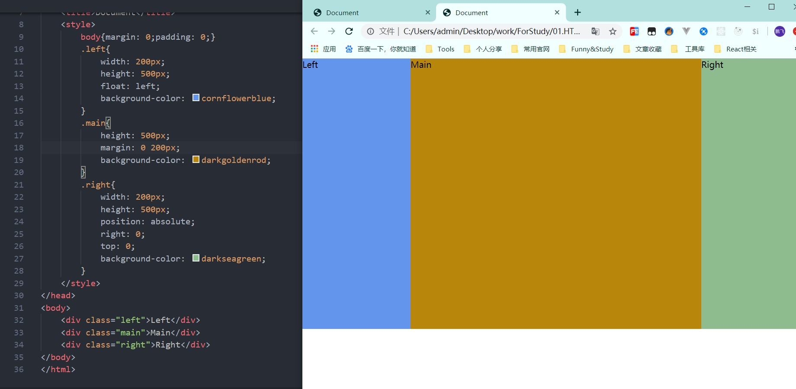
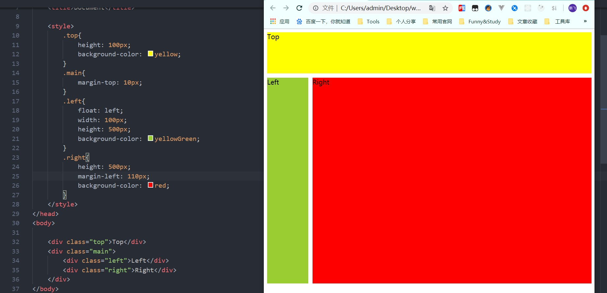
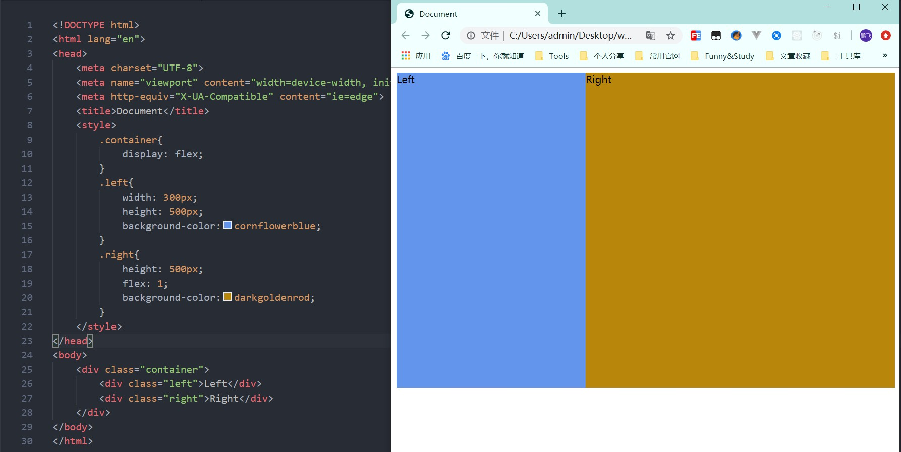
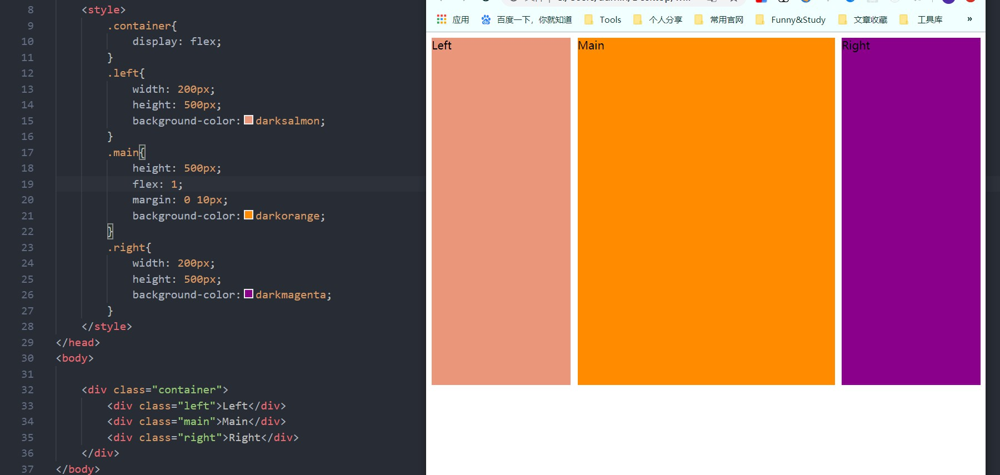
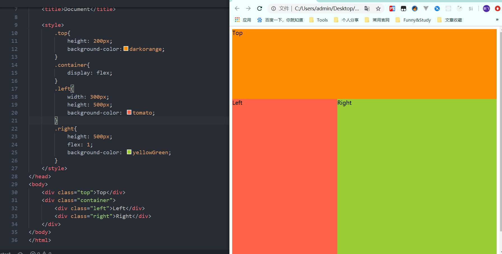

# CSS页面布局-float,flex,table,grid

> 本篇文章，我将采用上述几种不同的方式，来实现下面的六种布局

[TOC]

## 1. 布局展示

## 2. float

### 2.1 float 实现左右布局

~~~html

<body>
   

       
Left

       
Right

   

</body>
~~~

### 2.2 float + positon 实现左中右布局

~~~html

<body>
    
Left

    
Main

    
Right

</body>
~~~

### 2.3 float实现 上左右布局

- 上左右下类似，略

~~~html

<body>
    
Top

    

        
Left

        
Right

    

</body>
~~~

### 2.4 练习

**练习一：**float实现上左右下布局

**练习二：**float实现上左中右下布局

- [练习一源码](https://github.com/mapengfei47/Web/blob/master/2.CSS/CSS-Demo-Code/Float%E5%AE%9E%E7%8E%B0/float%E5%AE%9E%E7%8E%B0%E4%B8%8A%E5%B7%A6%E5%8F%B3%E4%B8%8B%E5%B8%83%E5%B1%80.html)
- [练习二源码](https://github.com/mapengfei47/Web/blob/master/2.CSS/CSS-Demo-Code/Float%E5%AE%9E%E7%8E%B0/float%20%2B%20position%20%E5%AE%9E%E7%8E%B0%E4%B8%8A%E5%B7%A6%E4%B8%AD%E5%8F%B3%E4%B8%8B%E5%B8%83%E5%B1%80%20.html)

## 3. Flex

### 3.1 flex实现左右布局

~~~html

<body>
    

        
Left

        
Right

    

</body>
~~~

### 3.2 flex实现左中右布局

~~~html

<body>
    

        
Left

        
Main

        
Right

    

</body>
~~~

### 3.3 flex实现上左右布局

~~~html

<body>
    
Top

    

        
Left

        
Right

    

</body>
~~~

### 3.4 练习

**练习一：**flex实现上左右下布局

**练习二：**flex实现上左中右下布局

- [练习一源码](https://github.com/mapengfei47/Web/blob/master/2.CSS/CSS-Demo-Code/Flex%E5%AE%9E%E7%8E%B0/04.flex%E5%AE%9E%E7%8E%B0%E4%B8%8A%E5%B7%A6%E5%8F%B3%E4%B8%8B%E5%B8%83%E5%B1%80.html)
- [练习二源码](https://github.com/mapengfei47/Web/blob/master/2.CSS/CSS-Demo-Code/Flex%E5%AE%9E%E7%8E%B0/05.flex%E5%AE%9E%E7%8E%B0%E4%B8%8A%E5%B7%A6%E4%B8%AD%E5%8F%B3%E4%B8%8B%E5%B8%83%E5%B1%80.html)

## 4. 优缺点对比

### 4.1 float布局

> **优点：**简单，兼容性好
>
> **缺点：**脱离文档流，需要手动清除浮动

### 4.2 flex

> **优点：**很完美的一种布局方案
>
> **缺点：**不兼容IE8以下的浏览器

### 4.3 定位

> **优点：**快捷，方便
>
> **缺点：**脱离文档流，维护成本高，不利于拓展

## 5. 清除浮动的方法

> 常见的清楚浮动主要有如下几种方法
>
> 1. 直接在最下面添加空元素块，并为空元素块添加属性 style="clear:both"
> 2. 使用伪类，`：after`