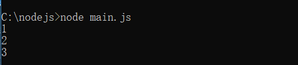

# nodejs入门


## 一. nodejs介绍

> 由于网上关于这种介绍性质的文章太多了，在此推荐几篇相关的介绍，以及提取一些关键字，大家简单了解一些即可，如想继续深入的同学，可以自行在网上搜索相关资源

:thumbsup:**相关文章推荐**

- [维基百科：Nodejs介绍](https://zh.wikipedia.org/zh-cn/Node.js)

- [百度百科：Nodejs介绍](https://baike.baidu.com/item/node.js/7567977?fromtitle=nodejs&fromid=11244313&fr=aladdin)

:point_down:**浅谈个人理解**

首先我们来看一下Nodejs官网的描述

> Node.js 是一个基于 Chrome V8 引擎的 JavaScript 运行环境
>
> Node.js 使用了一个事件驱动、非阻塞式 I/O 的模型，使其轻量又高效

**提取关键字**

- Nodejs是一个==JavaScript运行环境==，即给JavaScript代码提供运行平台，可以运行JavaScript代码的一个环境
- Nodejs使用了 ==事件驱动，非阻塞式I/O模型==
- Nodejs优点：轻量又高效

- 刚接触的同学不用去纠结事件驱动和非阻塞式I/O模型是什么，后面对nodejs有一定的了解之后，再回来查看这个介绍，一定会有不一样的认识


## 二. nodejs安装

nodejs的安装相对比较简单，这里推荐如下安装教程，对着该教程一步步操作下去即可成功安装nodejs

[菜鸟教程：nodejs安装](http://www.runoob.com/nodejs/nodejs-install-setup.html)

安装完成之后，在命令行输入 `node -v` 即可查看当前nodejs版本，由于我本地安装的nodejs版本是 V8.11.3，所以建议跟着我的笔记学习的小伙伴安装同样的nodejs版本，避免后续出现一些不可预见的小问题

nodejs安装完成之后，会附带的帮我们安装另一个工具，npm（node package manager）

**npm是什么**：通过npm的全称我们可以得知，npm是一个nodejs的包管理工具，我们可以使用npm工具便捷的管理我们需要使用到的nodejs模块包

这里同样建议，刚接触的同学不用纠结npm这个东西，跟着笔记一步一步的去使用，就能明白npm是什么，给我们的开发带来了哪些便捷，想深入了解的小伙伴，这里推荐两个链接

- [npm中文文档](https://www.npmjs.cn)
- [维基百科：npm介绍](https://zh.wikipedia.org/wiki/Npm)


## 三. npm命令

> 以下是npm常见命令，可以先混个眼熟，后续需要使用再来查看
>
> 前5个我用黑体标粗的是平时我们开发过程中使用得最多的几个命令

1. **`npm -v `：**查看npm版本。
2. **`npm init`：**初始化后会出现一个`package.json`配置文件。可以在后面加上`-y` ，快速跳过问答式界面。
3. **`npm install `：**会根据项目中的`package.json`文件自动下载项目所需的全部依赖。
4. **`npm install 包名 --save-dev`(`npm install 包名 -D`)：**安装的包只用于开发环境，不用于生产环境，会出现在`package.json`文件中的`devDependencies`属性中。
5. **`npm install 包名 --save`(`npm install 包名 -S`)：**安装的包需要发布到生产环境的，会出现在package.json文件中的`dependencies`属性中。
6. `npm list`：查看当前目录下已安装的node包。
7. `npm list -g`：查看全局已经安装过的node包。
8. `npm --help`：查看npm帮助命令。
9. `npm update 包名`：更新指定包。
10. `npm uninstall 包名`：卸载指定包。
11. `npm config list `：查看配置信息。
12. `npm 指定命令 --help `：查看指定命令的帮助。
13. `npm info 指定包名`：查看远程npm上指定包的所有版本信息。
14. ` npm config set registry https://registry.npm.taobao.org`： 修改包下载源，此例修改为了淘宝镜像。
15. `npm root`：查看当前包的安装路径。
16. `npm root -g`：查看全局的包的安装路径。
17. `npm ls 包名`：查看本地安装的指定包及版本信息，没有显示empty。
18. `npm ls 包名 -g`：查看全局安装的指定包及版本信息，没有显示empty。


## 四. 模块化的概念

> Node.js采用的是CommonJs规范，在NodeJS中，一般将代码合理拆分到不同的JS文件中，每一个文件就是一个模块，而文件路径就是模块名。
>
> 在编写每个模块时，都有`require`、`exports`、`module`三个预先定义好的变量可供使用。

### 4.1 详细说明

- **require：**用于在当前模块中加载和使用其他模块，传入一个模块名，返回一个模块导出对象。模块名可使用相对路径（以`./`开头），或者是绝对路径（以`/`或`C:`之类的盘符开头）。另外，模块名中的`.js`扩展名可以省略。以下是一个例子。

  ~~~js
  var person1 = require("./person");
  var person2 = require("./person.js");
  ~~~

- **exports：**`exports`对象是当前模块的导出对象，用于导出模块公有方法和属性。别的模块通过`require`函数使用当前模块时得到的就是当前模块的`exports`对象。以下例子中导出了一个公有方法。

  ~~~js
  exports.hello = function(){
      console.log("hello world!");
  }
  ~~~

- **module：**通过`module`对象可以**访问到当前模块的一些相关信息**，但最多的用途是**替换当前模块的导出对象**。例如模块导出对象默认是一个普通对象，如果想改成一个函数的话，可以使用以下方式。

  ~~~js
  module.exports = function(){
      console.log("替换当前模块化导出对象")
  }
  ~~~

  - 以上代码中，模块默认导出对象被替换为一个函数。

### 4.2 模块初始化 和主模块

> **模块初始化：**一个模块中的`JS`代码仅在模块第一次被使用时执行一次，并在执行过程中初始化模块的导出对象。之后，缓存起来的导出对象被重复利用。
>
> **主模块：**通过命令行参数传递给NodeJS以启动程序的模块被称为主模块。主模块负责调度组成整个程序的其它模块完成工作。例如通过以下命令启动程序时，`main.js`就是主模块。

```js
node main.js
```

### 4.3 Demo示例

在同级目录下面，创建`counter.js`，`main.js`，如下所示

```js
//counter.js

var i = 0;

function count() {
    return ++i;
}

exports.count = count;
```

```js
// main.js
var counter1 = require('./counter');
var counter2 = require('./counter');

console.log(counter1.count());
console.log(counter2.count());
console.log(counter2.count());
```

通过node 命令运行主模块，运行测试：

- 无论counter被初始化多少次，都是同一个counter对象




## 五. 总结

- NodeJS是一个JS脚本解析器，任何操作系统下安装NodeJS本质上做的事情都是把NodeJS执行程序复制到一个目录，然后保证这个目录在系统PATH环境变量下，以便终端下可以使用`node`命令。
- 终端下直接输入`node`命令可进入命令交互模式，很适合用来测试一些`JS`代码片段，比如正则表达式。
- `NodeJS`使用[CMD](http://wiki.commonjs.org/)模块系统，主模块作为程序入口点，所有模块在执行过程中只初始化一次。
- 使用npm工具来管理nodejs中的各种包模块

