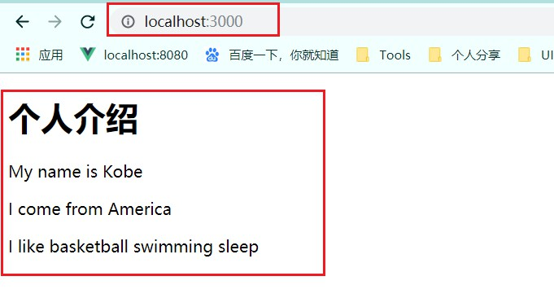

# nodejs中模版引擎的使用

## 一. art-template

> `art-template`是一款高性能的JavaScript 模板引擎，不仅可以在浏览器（前端）使用，同时也可以在Node中使用。
>
> **原理：**`art-template`原理就是将一个字符串数据按照模板引擎的语法替换掉其中的某些特定格式数据，然后产出我们所需的HTML文档。`art-template`支持两种语法：标准语法，原始语法，标准语法多以`{{}}`常见，原始语法多以`<% %>`常见。官网有详细说明
>
> **使用：**详细的语法使用规则参考官网的文档

[art-template中文文档](https://aui.github.io/art-template/zh-cn/docs/index.html)

## 二. Demo

> 接下来，我们使用art-template模版渲染一个HTML界面到浏览器上面

**1. 创建Demo文件夹，使用 npm init -y命令初始化文件夹**

**2. 在文件夹下安装 art-template模版**

~~~shell
npm install art-template -D
~~~

**3. 创建HTML模版**

~~~HTML
// index.html

<!DOCTYPE html>
<html lang="en">
<head>
    <meta charset="UTF-8">
    <meta name="viewport" content="width=device-width, initial-scale=1.0">
    <meta http-equiv="X-UA-Compatible" content="ie=edge">
    <title>{{ title }}</title>
</head>
<body>
    <h1>{{ title }}</h1>
    
My name is {{ name }}

    
I come from {{ from }}

    
I like {{each hobbies}} {{ $value }} {{ /each }}

</body>
</html>
~~~

**4. 创建服务器，渲染模版，加载数据**

~~~js
// server.js

const http = require('http')
const server = http.createServer()
const tempplate = require('art-template')
const fs = require('fs')

// 开启服务器的请求监听
server.on('request',(req,res)=>{
    if(req.url === '/'){
        fs.readFile('./index.html',(err,data)=>{
            if(err){
                return res.end('readFile failed...')
            }
            const dataStr = data.toString()
            // 通过art-template，将数据加载到模板界面
            const strHtml = tempplate.render(dataStr,{
                title: '个人介绍',
                name: 'Kobe',
                from: 'America',
                hobbies: ['basketball','swimming','sleep']
            })
            //讲加载完毕的模板字符串返回给浏览器
            res.end(strHtml)
        })
    }else{
        res.end('err url...')
    }
})

// 设置请求监听的端口号以及监听开启的回调函数
server.listen(3000,()=>{
    console.log('Server is running...')
})
~~~

**5. 启动服务器，在浏览器输入URL**

