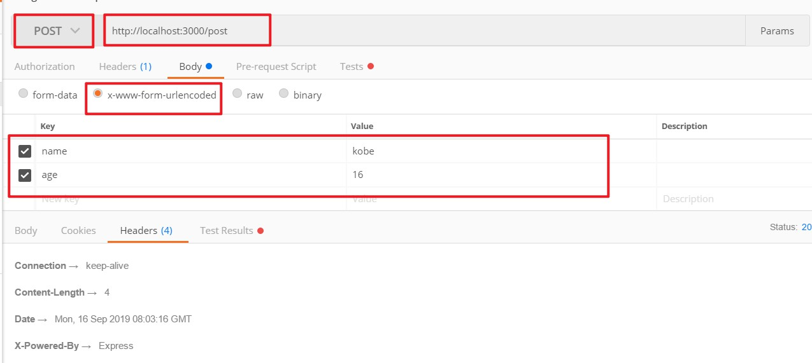

# express使用教程

[TOC]

## 一. express简单介绍

### 1.1 介绍

> Express 是一个基于 Node.js 封装的上层服务框架，它提供了更简洁的 API 更实用的新功能。它通过中间件和路由让程序的组织管理变的更加容易；它提供了丰富的 HTTP 工具；它让动态视图的渲染变的更加容易；它还定义了一组可拓展标准。

### 1.2 安装

~~~shell
npm install express -S
~~~

### 1.3 hello world

~~~js
let express = require('express')
let app = express()

app.get('/',(req,res) => res.end('hello world'))

app.listen(3000,() => console.log('Server is running...'))
~~~

**运行示例**

## 二. express中的静态服务

> 在web网站后端开发的过程中，我们往往需要**把一些静态文件夹暴露出去，用户可以根据url地址去访问到其中的内容**，这些静态文件往往也称之为**公共资源**，利用express框架可以方便地托管静态文件。

### 2.1 托管静态文件

1. 在项目目录新建 `public` 静态资源的文件夹

2. 托管静态文件：托管静态文件的方法有三种

### 2.2 托管方法

**方法一**（推荐）

~~~js
app.use('/public/',express.static('./public'))
~~~

为 `app.use()` 方法传递两个参数，第一个参数为访问的URL前缀，第二个为要托管的目录即要暴露的文件目录

~~~js
let express = require('express');
let app = express()

//设置静态资源
// 方法一
app.use('/public/',express.static('./public'))

app.listen(3000,() => console.log('Server is running...'))
~~~

**示例**

**方法二**

~~~js
app.use(express.static('./public'))
~~~

方法二在方法一的基础上，省略第一个参数，直接指定暴露的静态资源文件夹

~~~js
let express = require('express');
let app = express()

//设置静态资源
// 方法二
app.use(express.static('./public'))

app.listen(3000,() => console.log('Server is running...'))
~~~

**示例**

**方法三**

~~~js
app.use('/static/',express.static('./public'))
~~~

同方法一传参类似，只不过将第一个参数设置为你想访问的URL前缀，即指定前缀的别名

~~~js
let express = require('express');
let app = express()

//设置静态资源
// 方法三
app.use('/static/',express.static('./public'))

app.listen(3000,() => console.log('Server is running...'))
~~~

**示例**

## 三. express中获取post请求数据

> 在post请求中，请求的参数包含在 请求的body中，我们要获取post请求的数据，即是要获取request.body里面的数据
>
>  但是，在默认情况下，我们使用 req.body获取到的内容为undefine，这里需要使用一个中间件`body-parser`来解析传入的请求主体，使req.body可以被访问

**1. 安装 body-parser**

~~~shell
npm install body-parser express -S
~~~

**2. 创建server.js**

~~~js
// server.js

//引入模块
const express = require('express')
const bodyParse = require('body-parser')
// 创建服务器对象
const app = express()

/**
* 通过 body-parser中间件解析req.body
* 根据不同的 Content-Type分别有如下两种不同的配置
* post请求体中的Content—Type为：application/x-www-form-urlencoded，使用配置1
* post请求体中的Content-Type为：application/json，使用配置2
*/
app.use(bodyParse.urlencoded({extended:false}))
app.use(bodyParse.json())

//配置访问路由，返回post请求中的name参数
app.post('/post',(req,res)=>{
    const result = req.body
    console.log(result)
    res.end(result.name)
})

app.listen(3000,()=>console.log('Server is running on localhost:3000'))
~~~

**3. 开启服务器，可通过postman访问URL，自行配置body里面的参数信息，以及指定Content-Type**

**4. 最后点击左下角的body，即可查看我们服务器中的返回信息**

## 四. express中 art-template的使用

> 前面我们学习了如何在Nodejs中使用`art-template`，在express同样可以使用，接下来我们就来看看，如何在express中使用`art-template`

**1. 在express中使用art-template，首先要安装如下两个模块**

~~~shell
npm install art-template express-art-template -S
~~~

**2. 添加模版界面**

~~~html
// index.html

<!DOCTYPE html>
<html lang="en">
<head>
    <meta charset="UTF-8">
    <meta name="viewport" content="width=device-width, initial-scale=1.0">
    <meta http-equiv="X-UA-Compatible" content="ie=edge">
    <title>{{ title }}</title>
</head>
<body>
    <h1>{{ title }}</h1>
    
My name is {{ name }}

    
I come from {{ from }}

    
I like {{each hobbies}} {{ $value }} {{ /each }}

</body>
</html>
~~~

**3. 添加server.js文件**

~~~js
const express = require('express')
const app = express()

// 配置 express-art-template模版引擎，
//配置之后，服务器请求事件的回调函数的响应对象上会增加一个 render方法，用于渲染模版字符串返回渲染之后的结果
//  第一个参数 html 为模版文件拓展名，表示模版文件必须是HTML文件
app.engine('html',require('express-art-template'))

app.get('/',(req,res)=>{
    res.render('./index.html',{
        title: '个人介绍',
        name: 'Kobe',
        form: 'America',
        bobbies: ['basketball','swimming']
    })
})

app.listen(8000,()=>console.log('Server is running on localhost:3000'))
~~~

**4. 启动服务器，调用URL，我们发现，报如下错误**

~~~shell
Error: Failed to lookup view "./index.html" in views directory "C:\Users\admin\Desktop\work\ForStudy\8.Node.js\DemoFolder\express-art-template-demo\views"
~~~

**错误分析**

- 调用res.render方法的时候，默认会去同级目录的 views文件夹下面去找对应的文件
- 在这里由于我们的server.js和index.html在同级目录下，于是系统找不到views目录下的index.html文件，所以报错
- **规范：**我们一般将模版文件放在与server.js同级的views文件夹下面，方便调用
-  **自定义：**我们还可以通过如下方法，自定义我们希望查找模版界面的目录

~~~js
app.set('views', '替换的文件路径') // 第一个参数必须为：views
~~~

## 五. express中路由模块的提取

> 路由分为前端路由和后端路由，这里我们主要谈论的事后端路由，即URL地址

### 5.1 路由的概念

 **后端路由**

> 对于普通网站，所有的链接都是URL地址，URL地址即对应服务器上面的资源

**前端路由**

> 前端路由主要通过hash（#）来实现，通过hash值的改变来切换界面，同同时，hash值的改变并不会带来http请求的重新响应，使得加载页面的性能更好

### 5.2 路由的提取

> 通过前面的学习我们知道，可以通过express的get和post方法，对不同的URL地址做出响应，最终将结果返回給客户端
>
> **问题描述：**一旦我们的项目界面多了起来，需要处理的请求路径就会比较多，如果全部写在一个文件，就会使得文件难以维护，于是我们可以提取路由文件，专门用来配置路由，最后把路由对象导出挂载到服务器上即可

**实现：**

1. 使用 npm init -y 初始化，并且安装 express 模块

   ~~~shell
   npm init -y
   npm install express -S
   ~~~

2.  创建server.js文件

   ~~~js
   // server.js
   
   const express = require('express')
   const server = express()
   
   server.listen(3000,()=>{
       console.log('Server is running on localhost:3000')
   })
   ~~~

3. 路由文件

   ~~~js
   // router.js
   
   // 引入express并且获取路由对象
   const app = require('express')
   const router = app.Router()
   
   // 配置路由对象
   router.get('/',(req,res)=>{
       res.send('主页')
   })
   
   router.get('/login',(req,res)=>{
       res.send('登陆')
   })
   
   router.get('/register',(req,res)=>{
       res.send('注册')
   })
   
   // 导出路由对象
   module.exports = router
   ~~~

4. 在server.js文件中挂载路由对象

   ~~~js
   // server.js
   
   const express = require('express')
   const server = express()
   //挂载路由对象
   const router = require('./router')
   server.use(router)
   
   server.listen(3000,()=>{
       console.log('Server is running on localhost:3000')
   })
   ~~~

5. 演示

## 六. express框架案例-CRUD

> 在这里，我们一起通过express框架，来实现一个拥有增删改查功能的简易版学生管理系统

一共有如下几个文件

- db.json 存储数据的文件，模拟数据库
- StudentApi.js   API实现文件
- test.js  测试文件

~~~json
// db.json

{
    "students": [
        {
            "id": 1,
            "name": "YaoMing",
            "sex": "M",
            "hobbies": [
                "Basketball",
                "ComputerGame",
                "eating"
            ]
        },
        {
            "id": 2,
            "name": "YiJianLian",
            "sex": "M",
            "hobbies": [
                "Basketball",
                "earnMoney",
                "coding"
            ]
        },
        {
            "id": 3,
            "name": "Kobe",
            "sex": "M",
            "hobbies": [
                "basketball",
                "swimming",
                "sleep"
            ]
        }
    ]
}
~~~

~~~js
// StudentApi.js

/**
 * 提供一个简单的CRUD接口
 * 可通过如下增删改查的接口，实现一个简易的学生管理系统
 * 同时，可作为nodejs增删改查的模板
 */

const fs = require('fs')
// 提取数据源地址，方便后续维护
const dataBase = './db.json'

/**
 * 新增学生信息
 * Param：要新增的学生对象
 * 调用：add(student)
 *
 */
exports.add = (student)=>{
    fs.readFile(dataBase,(err,data)=>{
        // 错误处理
        if(err){
            return console.log('readFiel db.json error...')
        }
        // 获取学生数组
        var students = JSON.parse(data).students
        // 为新增的学生对象设置id值
        if(students.length === 0){
            student.id = 1
        }
        student.id = students[students.length-1].id + 1
        // 将新增的学生对象添加到学生数组
        students.push(student)
        let dataStr = JSON.stringify({studnets:studnets})
        // 将新增完成的学生数组写入文件
        fs.writeFile(dataBase,dataStr,(err)=>{
            if(err){
                return console.log('write to db.json failed...')
            }
            return console.log('添加成功')
        })
    })
}

/**
 * 更新学生信息
 * Param: 要修改的学生对象
 */
exports.update = (student)=>{
    fs.readFile(dataBase,(err,data)=>{
        // 错误处理
        if(err){
            return console.log('readFiel db.json error...')
        }

        // 获取学生数组
        var students = JSON.parse(data).students
        // 更新标识，用来判断是否有数据被更新
        var isUpdate = false

        // 遍历学生数组，找到要更新的那一个学生信息
        for(var i = 0;i<students.length;i++){
            // 当学生信息都没有发生变化的时候，不做更新
            if(students[i].id === student.id){
                if(students[i].name == student.name && students[i].sex == student.sex && students[i].hobbies.toString() == student.hobbies.toString()){
                    console.log('未做任何更新，无法提交学生信息')
                }else{
                    students[i].name = student.name
                    students[i].sex = student.sex
                    students[i].hobbies = student.hobbies
                    isUpdate = true
                }
            }
        }
        // 根据 isUpdata标识，判断是否有数据更新
        if(isUpdate){
            let dataStr = JSON.stringify({students:students})

            fs.writeFile(dataBase,dataStr,(err)=>{
                if(err){
                    return console.log('write to db.json failed...')
                }
                return console.log('跟新成功！')
            })
        }else{
            console.log('跟新失败')
        }
    })
}

/**
 * 查找所有学生信息，通过callback回调函数将students数组返回
 */
exports.searchAll = (callback)=>{
    fs.readFile(dataBase,(err,data)=>{
        if(err){
            return console.log('read file db.json err...')
        }
        callback(JSON.parse(data).students)
    })
}

/**
 * 通过id删除学生信息
 * Param: id：要删除的学生id
 */
exports.delete = (id)=>{
     fs.readFile(dataBase,(err,data)=>{
        if(err){
            return console.log('readFiel db.json error...')
        }

        var students = JSON.parse(data).students
        var isDelete = false
        // 遍历学生数组，删除指定id的学生信息
        for(var i = 0;i<students.length;i++){
            if(students[i].id === id){
                students.splice(i,1)
                isDelete = true
            }
        }
        // 通过 isDelete标识判断是否删除成功
        if(isDelete){
            let dataStr = JSON.stringify({students:students})

            fs.writeFile(dataBase,dataStr,(err)=>{
                if(err){
                    return console.log('write to db.json failed...')
                }
                return console.log('删除成功！')
            })
        }else{
            console.log('没有找到要删除的数据')
        }
    })
}
~~~

~~~js
// test.js
const api = require('./StudentApi')

var student = {
     "id": 3,
    "name": "Kobe",
    "sex": "M",
    "hobbies": [
        "basketball",
        "swimming",
        "sleep"
    ]
}
// api.add(student,null)

// api.searchAll((data)=>{
//     console.log(data)
// })

// api.delete(4)
// api.update(student)

~~~

## 七. express-middleware

> **middleware：**即中间件，在express中是很重要的一个概念
>
> **官网的介绍：**Express 是一个路由和中间件 Web 框架，其自身只具有最低程度的功能：Express 应用程序基本上是一系列中间件函数调用。
>
> **作用：**简单来说，就是当我们在浏览器中发送URL请求开始，到我们在浏览器接收到数据和看到界面渲染为止，这中间的所有过程都是通过 express中间件来完成的

### 7.1 前景回顾

其实在我们之前的学习过程中，我们已经使用过express中间件了，现在我们来一起回顾一下

- 当我们在使用开发静态资源的时候
- 当我们为了获取post请求的body参数的时候

这两种场景都用到了express中间件，我们发现，他们都有一个共同的特征，即都是通过 app.use方法来调用的

~~~js
const express = reuire('express')
const app = express()

// 开放静态资源
app.use('/public/',express.static('./public'))
// 获取post请求参数配置
app.use(bodyParser.urlencoded({extended:false}))
app.use(bodyParser.json())
~~~

### 7.2 中间件分类和基础

**分类：**

> express应用程序可以执行如下几种类型的中间件

- 应用层中间件
- 路由器层中间件
- 错误处理中间件
- 内置中间件
- 第三方中间件

**基础：(重要)**

中间件简单来说就是一系列函数，就是在请求返回之前，我们对数据进行的一系列处理逻辑的执行函数

每一个函数都包含三个参数：`req,res,next`

- req：包含请求对象相关信息

- res：包含相应对象相关信息

- next（）：控制中间件传播流程

  - 这里重点介绍一下next（），由于存在中间件的堆栈关系，以及存在一个路径可以配置多个路由的做法存在，所以就需要我们通过next（）方法合理的控制中间件的调用

  ~~~js
  // 这里拿一个中间件做示范
  
  // 如下，use方法里面的多个函数即为中间件的堆栈，可以通过next方法，让他们按照顺序执行，如果前面的方法没有调用next()方法，则后面的函数就不会执行，请求将会停留在该中间件中，不会继续执行
  app.use('./demo',function(req,res,next){
      console.log('第一个中间件函数')
      next()
  },function(req,res,next){
      console.log('第二个中间件函数')
     // next()
  },function(req,res,next){
      console.log('第三个中间件函数，如果上面的方法没有调用next（），则这里不会执行')
      next()
  })
  
  // demo路径的第二个路由，能否执行要依赖于前面的中间件是否调用了next()方法
  app.use('./demo',function(req,res,next){
      console.log('第二个路由的中间件1')
      next()
  },function(req,res,next){
      console.log('第二个路由的中间件2')
     // next()
  },function(req,res,next){
     res.send('hello world')
  })
  
  ~~~

  

### 7.3 应用层中间件

> 使用 `app.use()`或者`app.METHOD()`函数将 中间件绑定到应用程序对象的实例，其中METHOD是中间函数处理的请求的小写HTTP方法

**Demo1：**未指定路径的中间件，所有的请求都会先执行该方法

~~~js
const app = express()

app.use(function(req,res,next){
    console.log(Date.now())
    next()
})
~~~

**Demo2：**指定路径上的中间件，只有符合指定路径的请求才会调用该中间件

~~~js
const app = express()

// 只有指定路径下的请求才会调用该中间件
app.use('/a',function(req,res,next){
    console.log(Date.now())
    next()
})
~~~

**Demo3：**可以通过添加多个function，实现中间件堆栈的调用效果

~~~js
const app = express()

app.use('/user', function(req, res, next) {
  console.log('Request URL:', req.originalUrl);
  next();
}, function (req, res, next) {
  console.log('Request Type:', req.method);
  next();
});

app.get('/user',(req,res)=>{
    console.log('user目录')
    res.send('user目录')
})
~~~

结果：

~~~shell
Request URL: /user
Request Type: GET
user目录
~~~

**Demo4：**为同一个路径定义多个路由，如果前面路由使请求结束，则后面路由不会调用，否则会按顺序调用

~~~js
// Demo4：为同一个路径定义多个路由，如果前面路由使请求结束，则后面路由不会调用，否则会按顺序调用
app.get('/more',(req,res,next)=>{
    console.log('more第一个路由的第一次调用')
    next()
},function(req,res,next){
    // console.log('随便打印点什么')
    // next()
    res.send('这里使请求结束，后续的路由将不会调用')

})

app.get('/more',(req,res,next)=>{
    console.log('more第二个路由的第一次调用')
    next()
},function(req,res,next){
    res.send('more第二个路由的第二次调用')
})
~~~

**Demo5：**

- 可以通过 next（'route'）方法，跳过路由中间件堆栈中的路由，将控制权交给下一个路由
- **注意：next('route')方法只在GET，PUT，POST方法中有效**
  - app.get()，app.put()，app.post()
  - router.get()，router.put()，router.post()

~~~js
// Demo5：通过 next('route')方法跳出堆栈，将控制权交给下一个路由
app.get('/demo5',(req,res,next)=>{
    console.log('demo5第一个路由的第一次调用')
    next()
},function(req,res,next){
    console.log('welcome to demo5')
    //next()
    next('route')
},function(req,res,next){
    console.log("如果前面调用了next('route')方法，这里将不会调用")
    next()
})

app.get('/demo5',(req,res,next)=>{
    console.log('demo5第二个路由的第一次调用')
    next()
},function(req,res,next){
    res.send('demo5第二个路由的第二次调用')
})
~~~

结果：

~~~js
demo5第一个路由的第一次调用
welcome to demo5
demo5第二个路由的第一次调用

//浏览器展示
demo5第二个路由的第二次调用
~~~

### 7.4 路由中间件

> 路由中间件类似于应用层中间件，只不过在应用层中间件的基础上，将路由模块抽离出来，实现方法同上
>
> 这里只做简单Demo示例

**Demo**

~~~js
const express = require('require')
const app = express()
const router = app.Router()

router.use('/user', function(req, res, next) {
  console.log('Request URL:', req.originalUrl);
  next();
}, function (req, res, next) {
  console.log('Request Type:', req.method);
  next();
});

router.use('/user', function(req, res, next) {
  console.log(Date.now());
  next();
}, function (req, res, next) {
  res.end('hello world')
});
~~~

### 7.5 错误处理中间件

> 错误处理中间件用法同上，只有一点不同
>
> 错误处理中间件**始终采用*四个*自变量。必须提供四个自变量**，以将函数标识为错误处理中间件函数。即使无需使用 `next` 对象，也必须指定该对象以保持特征符的有效性。否则，`next` 对象将被解释为常规中间件，从而无法处理错误。

**Demo：**

~~~js
app.use(function(err, req, res, next) {
  console.error(err.stack);
  res.status(500).send('Something broke!');
});
~~~

### 7.6 内置中间件

> Express 中唯一内置的中间件函数是 `express.static`
>
> **语法：**express.static(root, [options])
>
> **参数：**
>
> - `root` 自变量指定从其中提供静态资源的根目录。
> - options包含一系列的参数配置
>
> **作用：**配置应用程序的静态文件目录，可通过静态路径直接在浏览器获取静态文件目中的文件
>
> **详情：**[Github：server-static](https://github.com/expressjs/serve-static)

**Demo：**对于应用程序，可以配置多个静态目录

~~~js
app.use(express.static('public'));
app.use(express.static('uploads'));
app.use(express.static('files'));
~~~

### 7.7 第三方中间件

> **使用：**
>
> - 第三方中间件属于nodejs模块，需要先安装
> - 通过在应用层或路由器层的应用程序中将其加装入
>
> **详情：**[express官网：第三方中间件](https://expressjs.com/zh-cn/resources/middleware.html)

**Demo：**第三方中间件 cookie-parser的使用

~~~shell
npm i cookie-parser -S
~~~

~~~js
var express = require('express');
var app = express();
var cookieParser = require('cookie-parser');

// load the cookie-parsing middleware
app.use(cookieParser());
~~~

