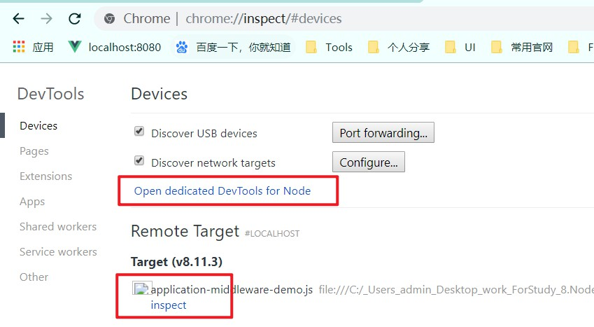
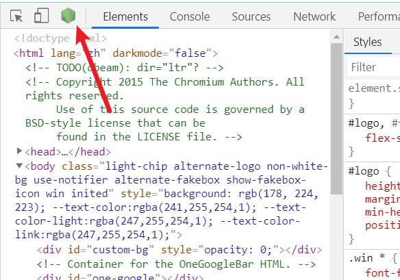

# Nodejs学习积累

## 1. 在代码中生成目录结构

- 全局安装 treer模块

~~~shell
npm install treer -g
~~~

- 在需要生成目录文件的命令窗口下运行treer命令即可

~~~shell
treer
C:\Users\admin\Desktop\work\ForStudy\8.Node.js
├─01.nodejs入门.md
├─02.nodejs的代码组织和部署.md
├─03.nodejs中加载第三方包的规则.md
├─04.node中的核心模块.md
├─99.Nodejs好文推荐.md
├─express使用教程.md
├─服务端渲染.md
├─模块化与规范.md
├─imgs
|  ├─express-helloworld.gif
|  ├─express-static-method1.jpg
|  ├─express-static-method2.jpg
|  ├─express-static-method3.jpg
|  ├─http-demo-plus.gif
|  └node入门_01.png
├─DemoFolder
|     ├─核心模块-path-os
|     |      └pathDemo.js
|     ├─核心模块-http
|     |     ├─server-plus.js
|     |     └server.js
|     ├─核心模块-fs
|     |    ├─copy.json
|     |    ├─db.json
|     |    ├─demo_01_readfile.js
|     |    └readFileThenWrite.js
~~~

## 2. nodejs代码调试

> 在开发过程中，我们经常需要调试代码，今天我们就来学习一下，怎么调试nodejs中的代码
>
> **拓展：**`--inspect-brk` 可以通过添加该命令，在运行文件的第一行就设置断点

### 第一步： node --inspect 命令运行文件

~~~shell
node --inspect 文件名
~~~

### 第二步：打开调试窗口

打开调试窗口的方法有两种

**第一种：**

1. 打开浏览器，输入 `chrome://inspect` 或者 `about:inspect` 即可进入如下界面

2. 点击上图圈出来中的任意一处即可跳转到调试界面，在source选项下可以看到我们需要调试的文件
   - 如果没有出现刷新浏览器即可

3. 在文件左侧打上断点，在浏览器发送请求即可开始调试

**第二种：**

1. 打开浏览器，打开开发者工具，点击如下图标，即可进入调试界面

2.  source目录下找到代码，打上断点，发送请求，即可开启调试