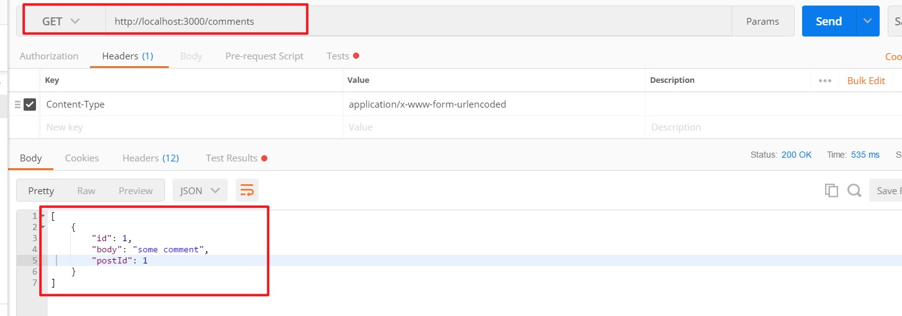
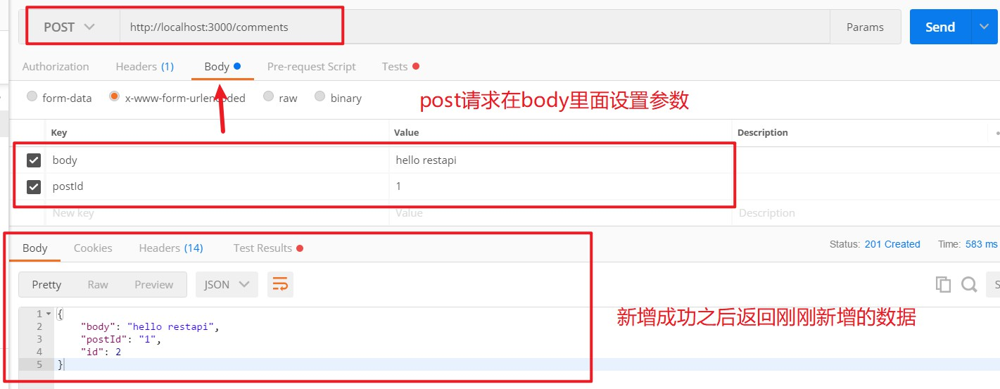
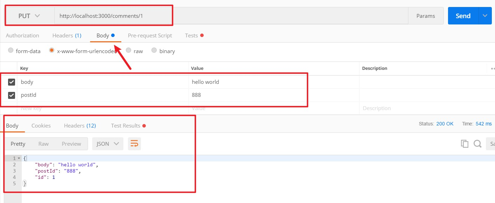
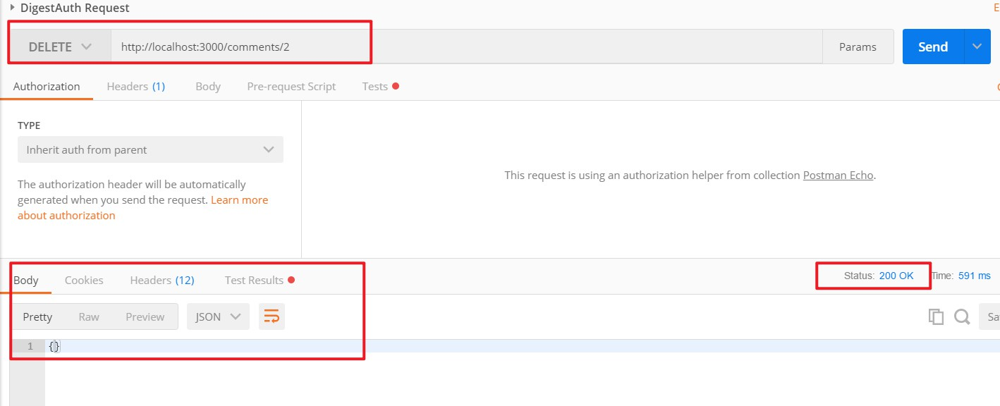

# Json-server使用教程

[TOC]

## 一. json-server介绍

> **json-server：**一个在前端本地运行，可以存储数据的server
>
> **作用：**模拟接口，操作模拟数据

## 二. json-server的使用

### 2.1 安装

~~~shell
npm install json-server -D
~~~

- 安装完成之后，可以通过 `json-server -h` 命令检查是否安装成功

~~~shell
json-server [options] 

Options:
  --config, -c       指定 config 文件                  [默认: "json-server.json"]
  --port, -p         设置端口号                                   [default: 3000]
  --host, -H         设置主机                                   [默认: "0.0.0.0"]
  --watch, -w        监控文件                                           [boolean]
  --routes, -r       指定路由文件
  --static, -s       设置静态文件
  --read-only, --ro  只允许 GET 请求                                    [boolean]
  --no-cors, --nc    禁止跨域资源共享                                   [boolean]
  --no-gzip, --ng    禁止GZIP                                          [boolean]
  --snapshots, -S    设置快照目录                                     [默认: "."]
  --delay, -d        设置反馈延时 (ms)
  --id, -i           设置数据的id属性 (e.g. _id)                     [默认: "id"]
  --quiet, -q        不输出日志信息                                     [boolean]
  --help, -h         显示帮助信息                                       [boolean]
  --version, -v      显示版本号                                         [boolean]
~~~

### 2.2 使用

1. 安装 `json-server`

2. 创建 db.json文件

   ~~~json
   {
     "posts": [
       {
         "id": 1,
         "title": "json-server",
         "author": "typicode"
       }
     ],
     "comments": [
       {
         "id": 1,
         "body": "some comment",
         "postId": 1
       }
     ],
     "profile": {
       "name": "typicode"
     }
   }
   ~~~

3. 运行

   ~~~shell
   json-server db.json
   ~~~

   ~~~shell
   Loading db.json
   Done
   
   Resources
   http://localhost:3000/posts
   http://localhost:3000/comments
   http://localhost:3000/profile
   
   Home
   http://localhost:3000
   ~~~

4. 在浏览器输入上述 url，即可访问响应的数据

## 三. 支持的方法

> 可以使用任何 HTTP方法

- **查询**
  - GET /list 获取列表
  - GET /list/1 获取id=1的数据

- **新增**
  - POST /list 创建一个项目

- **修改**
  - PUT /list/1 更新一个id为1的数据
  - PATCH /list/1 部分更新id为1的数据
- **删除**
  - DELETE /list/1 删除id为1的数据

**注意：**

- 当你发送POST，PUT，PATCH 或者 DELETE请求时，变化会自动安全的保存到你的db.json文件中。

- 你的请求体body应该是封闭对象。比如`{"name": "Foobar"}`

- id不是必须的，在PUT或者PATCH方法中，任何的id值将会被忽略。

- 在POST请求中，id是可以被添加的，如果该值没有没占用，会使用该值，否则自动生成。

- POST，PUT或者PATCH请求应该包含一个`Content-Type:application/json`的header，来确保在请求body中使用json。

  

## 四. CRUD-Demo

> 以下的dmeo，我们都使用postman工具来完成
>
> 执行之前，先使用 `json-server db.json`运行服务器

### 4.1 查询

- GET请求：`http://localhost:3000/comments`

### 4.2 新增

- POST请求：`http://localhost:3000/comments`
- 参数：`{"body":"hello restapi","postId":1}`

### 4.3 修改

- PUT请求：`http://localhost:3000/comments/1`
- 参数：`{"body":"hello world","postId":888}`

### 4.4 删除

- DELETE请求：`http://localhost:3000/comments/2`

### 4.5 使用ajax发送增删改查请求

> 我们还可以通过jQuery的ajax来发送操作数据的请求

~~~js
 //新增
$.ajax({
    type: 'POST',
    url: 'http://localhost:3000/comments',
    data:{
        body:'hello world',
        postId:888
    },
    success: function (data) {
        console.log(data)
    }
})

//查询
$.ajax({
    type: 'GET',
    url: 'http://localhost:3000/comments',
    success: function (data) {
        console.log(data)
    }
})

//修改
$.ajax({
    type: 'PUT',
    url: 'http://localhost:3000/comments/1',
    data:{
        body:'hello world',
        postId:888
    },
    success: function (data) {
        console.log(data)
    }
})

//删除
$.ajax({
    type: 'DELETE',
    url: 'http://localhost:3000/comments/1',
    success: function (data) {
        console.log(data)
    }
})
~~~

## 五. 过滤

> 我们可以通过在URL后面加上参数，来达到过滤数据的目的

**例如：**

- `http://localhost:3000/comments/1`：查询id为1的数据，返回一个对象
- `http://localhost:3000/comments?name=zhangsan`：返回一个数组，name值都为zhangsan

## 六. 注意

> 如果需要使用 json-server 模拟多层路由嵌套，无法通过 db.json中数据的多层嵌套，达到模拟多层路由嵌套的目的。
>
> 也就是说，路由只能匹配到 db.json这个json最外层的key值。而里层的key值，都不会被路由匹配

