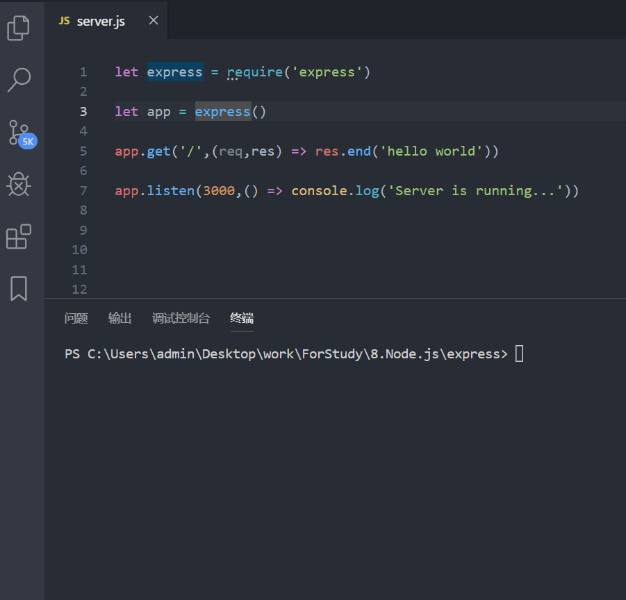
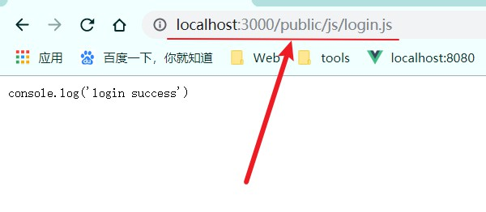
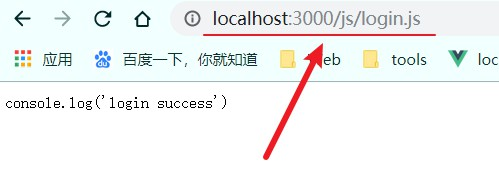

# express使用教程

[TOC]

## 一. express简单介绍

### 1.1 介绍

> Express 是一个基于 Node.js 封装的上层服务框架，它提供了更简洁的 API 更实用的新功能。它通过中间件和路由让程序的组织管理变的更加容易；它提供了丰富的 HTTP 工具；它让动态视图的渲染变的更加容易；它还定义了一组可拓展标准。

### 1.2 安装

~~~shell
npm install express -S
~~~

### 1.3 hello world

~~~js
let express = require('express')
let app = express()

app.get('/',(req,res) => res.end('hello world'))

app.listen(3000,() => console.log('Server is running...'))
~~~

**运行示例**

## 二. express中的静态服务

> 在web网站后端开发的过程中，我们往往需要**把一些静态文件夹暴露出去，用户可以根据url地址去访问到其中的内容**，这些静态文件往往也称之为**公共资源**，利用express框架可以方便地托管静态文件。

### 2.1 托管静态文件

1. 在项目目录新建 `public` 静态资源的文件夹

2. 托管静态文件：托管静态文件的方法有三种

### 2.2 托管方法

**方法一**（推荐）

~~~js
app.use('/public/',express.static('./public'))
~~~

为 `app.use()` 方法传递两个参数，第一个参数为访问的URL前缀，第二个为要托管的目录即要暴露的文件目录

~~~js
let express = require('express');
let app = express()

//设置静态资源
// 方法一
app.use('/public/',express.static('./public'))

app.listen(3000,() => console.log('Server is running...'))
~~~

**示例**

**方法二**

~~~js
app.use(express.static('./public'))
~~~

方法二在方法一的基础上，省略第一个参数，直接指定暴露的静态资源文件夹

~~~js
let express = require('express');
let app = express()

//设置静态资源
// 方法二
app.use(express.static('./public'))

app.listen(3000,() => console.log('Server is running...'))
~~~

**示例**

**方法三**

~~~js
app.use('/static/',express.static('./public'))
~~~

同方法一传参类似，只不过将第一个参数设置为你想访问的URL前缀，即指定前缀的别名

~~~js
let express = require('express');
let app = express()

//设置静态资源
// 方法三
app.use('/static/',express.static('./public'))

app.listen(3000,() => console.log('Server is running...'))
~~~

**示例**

