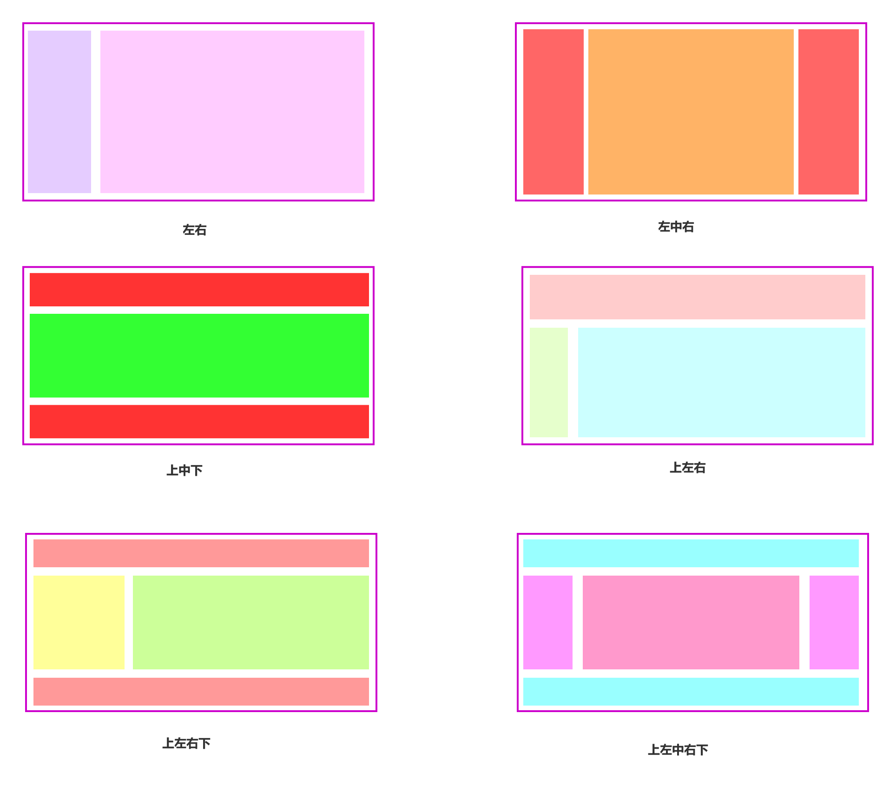

# 网页经典布

> **技术要点：**5种实现方式，6种经典布局
>
> **说明：**本文将通过5中方式分别实现6种经典的网页布局，并分析其各自的优缺点
>
> **目的：**熟悉基本的页面布局，夯实基础，应对面试

[TOC]

## 一.布局和实现方式介绍

### 1.1 经典布局

- **首先，我们来看一下基本的6种页面经典布局**

### 1.2 实现方式

- 通常我们实现网页布局的方式大概有如下几种

> 1. float：浮动方式
> 2. position：定位方式
> 3. flexbox方式
> 4. table方式
> 5. 网格grid

## 二.左右布局

### 2.0 通用配置

~~~css
html *{
    margin:0px;
    padding: 0px;
}
.layout article div{
    min-height:100px;
}
~~~

### 2.1 float实现

~~~HTML
<!-- 浮动方式实现左右布局 -->
    <section class="layout float">
        
        <h1>浮动实现</h1>
        <article class="left-right">
            

            

                浮动解决翻案
                浮动解决翻案
                浮动解决翻案
                浮动解决翻案
                浮动解决翻案
                浮动解决翻案
            

        </article>
    </section>
~~~

### 2.2 绝对定位

~~~html
<!-- 定位方式实现左右布局 -->
    <section class="layout absolute">
            
            <h1>定位实现</h1>
            <article class="left-right">
                

                

                    定位解决方案
                    定位解决方案
                    定位解决方案
                    定位解决方案
                    定位解决方案
                    定位解决方案
                

            </article>
        </section>
~~~

### 2.3 flexbox实现

~~~HTML
 <!-- flexbox方式实现左右布局 -->
     <section class="layout flexbox">
            
            <h1>flexbox实现</h1>
            <article class="left-right">
                

                

                    Flex 解决方案
                    Flex 解决方案
                    Flex 解决方案
                    Flex 解决方案
                    Flex 解决方案
                    Flex 解决方案
                

            </article>
        </section>
~~~

### 2.4 table实现

~~~HTML
<!-- table方式实现左右布局 -->
    <section class="layout table">
            
            <h1>table实现</h1>
            <article class="left-right">
                

                

                    table 解决方案
                    table 解决方案
                    table 解决方案
                    table 解决方案
                    table 解决方案
                    table 解决方案
                

            </article>
        </section>
~~~

### 2.5 网格grid实现

~~~HTML
 <!-- 网格布局方式实现左右布局 -->
    <section class="layout grid">
            
            <h1>网格实现</h1>
            <article class="left-right">
                

                

                    网格 解决方案
                    网格 解决方案
                    网格 解决方案
                    网格 解决方案
                    网格 解决方案
                

            </article>
        </section>
~~~

